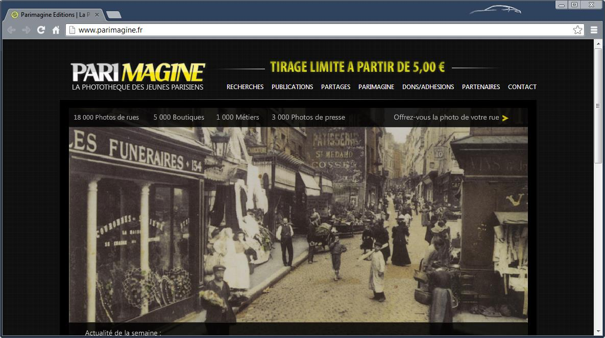

parimagine
==========

## Généralités

### Contexte

__Parimagine Editions__ & __La Photothèque des Jeunes Parisiens__ gèrent un fond de « _plus de 20 000 documents photographiques (...) représentant 20 années de recherches iconographiques auprès des familles, des collectionneurs de cartes postales et de photos de presse sur les rues du vieux Paris et des communes d’Ile-de-France_ » cf. [http://www.parimagine.fr/contents/parimagine]()

### Objectif

Le présent document a pour objectif de décrire comment les technologies les plus récentes 
    ([Cloud](https://en.wikipedia.org/wiki/Cloud_computing), 
     [Mobile](https://en.wikipedia.org/wiki/Mobile_computing), 
     [Social Web](https://en.wikipedia.org/wiki/Social_Web)
    ) peuvent être mises en place pour 
1.  aider l’association La Photothèque des Jeunes Parisiens à remplir ses objectifs, et
2.  assurer la pérennité économique de Parimagine Editions.

### Qui suis-je ?

Christophe Thiébaud, _development architect_ de profession pour SAP Walldorf, Allemagne, et en ce moment _CTO, Chief Technical Officer_ absolument et totalement et pleinement bénévole de l’association __La Photothèque des Jeunes Parisiens__.

+ [LinkedIn](http://www.linkedin.com/profile/view?id=367152)
+ [Facebook](https://www.facebook.com/christophe.thiebaud)
+ [Twitter](https://twitter.com/cthiebaud)
 
## Etat des lieux

### Aujourd’hui

__Parimagine Editions__ & __La Photothèque des Jeunes Parisiens__ sont déjà présents sur internet à l’adresse [http://www.parimagine.fr/]().

 
D’un point de vue technique, le site est réalisé en PHP, et se base principalement sur le logiciel open source piwigo, « un logiciel de galerie photo pour le web ».

#### Avantages

Une large partie ( > 8000 documents) du fond de documents photographiques de La Photothèque des Jeunes Parisiens est disponible sous piwigo. Cela comprend toutes les métadonnées (didascalies, adresses, propriétaires, etc.) sous forme structurée, i.e. dans une base de données relationnelle.

http://piwigo.com/blog/ est toujours activement développé. Des plugins et extensions récents existent pour le mobile ou le social web.

#### Inconvénients

La mise à jour du site requiert des compétences d’administrateur système, voire de développeur PHP et/ou  base de données, compétences qui font malheureusement défaut à Parimagine actuellement. Cela vaut surtout pour la mise à jour technique, par ex. installation des nouvelles versions de piwigo, mais aussi pour la mise à jour des contenus, par ex. ajout de pages pour les nouvelles parutions, ou nouvelles photos.

Le look & feel de piwigo est quelque peu désuet. Etrangement (pour un site de partage de photos) les photos pourraient être mieux mises en valeur.

La fonctionnalité de recherche textuelle est primitive.
 
### Prototype

A la demande de Manuel, ami de trente ans, fraîchement nommé président de l’association, j’ai donc développé un prototype de ce que pourrait être le(s) site(s) de Parimagine Editions & de La Photothèque des Jeunes Parisiens.

Tout d’abord, j’ai séparé le site de la maison d’édition du site de la photothèque.

#### Photothèque

Pour la photothèque, l’inspiration m’est venue du site http://www.retronaut.com/, « see the past like you wouldn't believe », où les photos d’époques sont mises en valeur de manière fort plaisante.

_Avertissement : toutes les photos des exemples suivants contiennent malheureusement un filigrane particulièrement intrusif, ce qui demande un grand effort au lecteur pour pouvoir imaginer de ce que sera le résultat final. Merci de votre indulgence._

##### Accueil

La page d’accueil présente une sélection de photos choisies rigoureusement au hasard :

Il est aussi possible d’afficher les photos par

 arrondissements   ou par  thème   . 

##### Déroulement infini

Toutes les pages utilisent la technique dite de l’infinite scrolling, (déroulement infini, en bon français ?), popularisée par facebook, twitter, et ce même retronaut : on déroule vers le bas, et de nouvelles photos apparaissent, à l’infini. J’en veux pour preuve, après une série de déroulement vers le bas, la taille minuscule du curseur ci-dessous : 

Cette technique met particulièrement en valeur la quantité vertigineuse des contenus.

##### Recherche textuelle

Il est aussi possible de rechercher dans l’ensemble des textes (didascalies, adresses, etc.) une série de termes particulier. Par exemple, le mot ‘rosiers’  nous offre - assez prévisiblement - les photos de la rue des rosiers, dans le 4ème arrondissement :

[http://photos.parimagine.fr/?search=rosiers]()

##### Plein écran 

Cliquer sur une photo l’affiche plein écran :  

##### Adressabilité 

Chaque photo a sa propre page, accessible directement via la barre d’adresse du navigateur. La page inclut des boutons de navigation photo suivante / photo précédente, et un embryon de gadgets sociaux :

[http://photos.parimagine.fr/photo/1698]()

##### Réseau social

Chaque photo peut donc être partagée sur votre réseau social préféré facebook, pour être le sujet de discussions fructueuses pour votre ego (le mien en l’occurrence dans l’exemple ci-dessous):

##### Géo-localisation

Toute photo dont l’adresse est renseignée - même de façon incomplète - peut être géo-localisée en utilisant l’API de google maps. 

En cliquant sur l’icône de mappemonde en bas à droite de ces photos …

  … on accède alors à la carte de Paris sur google maps, associée à la vue actuelle (‘street view’) du lieu.

_Avertissement : l’état actuel du prototype ne sauvegarde pas la géo-localisation précise, vous n’obtiendrez pas un résultat aussi spectaculaire en testant in vivo … mais ça va venir !_

##### Avant/Après

Il est alors possible, grâce à un effort raisonné et raisonnable de mise en place des photos avant et après, de produire un artefact spectaculaire : 

[http://dev.parimagine.fr/before-after.html]()

##### Géo-localisation (2)

Google maps permet aussi, à peu de frais, de lier les photos géo-localisée à la carte de Paris :

[http://dev.parimagine.fr/maps.html ]()

Cliquer sur la marque  (ci-dessus au bout de la grosse flèche rouge) nous télé-transporte immédiatement vers les photos de la rue L'Abbé Groult de la photothèque :  

#### Parimagine

Quelques pages statiques donnent accès aux informations concernant Parimagine Editions :

+ [http://dev.parimagine.fr/](Nouveautés)
+ [http://dev.parimagine.fr/contacts.html](Contacts)
+ [http://dev.parimagine.fr/who.html](Qui sommes-nous ?)

#### Open Source

Ce prototype est open source, et les personnes intéressées par l’aspect technique peuvent accéder au code source ici : [https://github.com/parimagine/parimagine.]().

En 2 mots : les 8000+ photos sont stockées sur une instance de SAP HANA Cloud (instance gracieusement offerte par SAP pour le test et le développement). Cette instance expose un API REST pour sélectionner, trier, lire et écrire les photos. 

L’interface utilisateur est basée principalement sur les logiciels ouverts jquery  et bootstrap et utilise des requêtes ajax pour accéder aux services REST.

## Demain (à finir)

A finir demain, d’ailleurs :)

### Les 10 Principes de Wilson

L’application [http://www.avc.com/a_vc/2010/03/10-golden-principles-of-successful-web-apps.html](respecte les 10 principes de Wilson).

### Crowdsourcing

L’application collecte et organise les données et informations provenant de son utilisation. Par exemple, elle présente sous forme de jeu la géo-localisation précise d’une photo, elle invite les utilisateurs à noter leurs préférences, etc. 

Dans le style de stackoverflow ou wikipedia, elle permet aux utilisateurs d’influer sur le contenu même.

### Réseaux sociaux

L’application s’intègre avec les réseaux sociaux les plus populaires (facebook, twitter, tumblr). Pour augmenter sa visibilité et pour éviter de réinventer la roue.

### Téléphonie mobile et intelligente

L’application sait traiter les données de géo-localisation qui arrivent des utilisateurs connectés via smartphone, et offre la visualisation in situ des photos d’époque associées au lieu où ils se trouvent sur leur téléphone portable.

### Ecosystème

L’application est totalement ouverte et programmable, et permet aux innombrables acteurs de l’écosystème associatif parisien de consommer et d’enrichir ses services.

### Pérennité

L’application est totalement gratuite, mais agit comme vecteur vers des activités marchandes qui permettent de soutenir l’activité de la photothèque en minimisant le recours à la puissance publique. 

Tout d’abord en soutenant l’activité éditoriale. Mais aussi, en supportant d’autres formes de revenus, en vrac :

+   Evénements 
+   Edition sur demande
+   Cotisations
+   Freemium
+   Enterprise
+   Services localisés
+   Merchandising
+   Franchising
+   etc.

Le point important à souligner est que l’application permet l’analyse détaillée des comportements des utilisateurs, ainsi que leur segmentation, pour investiguer, modéliser et tester d’autres formes de revenus, qui semblent pour l’heure encore assez floues.
